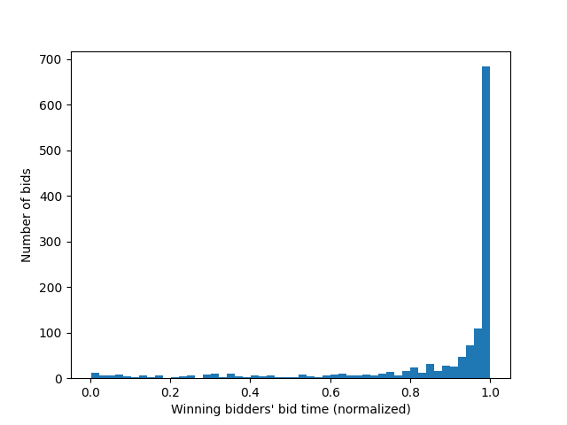
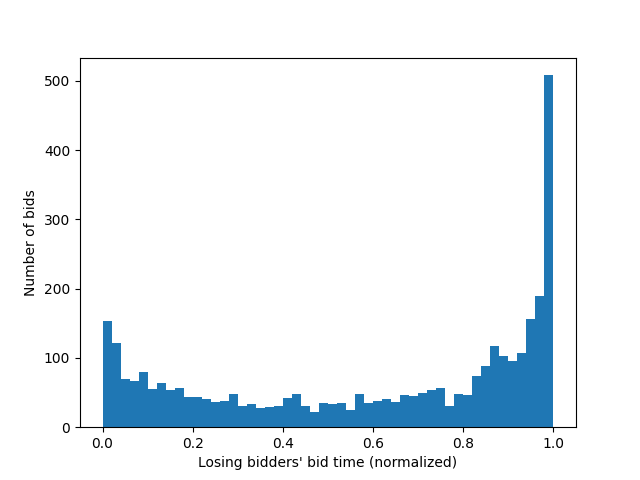
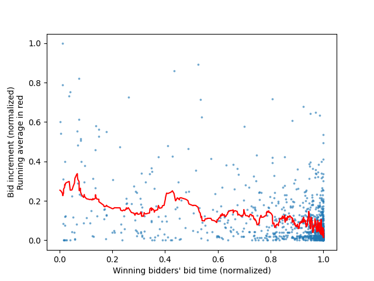
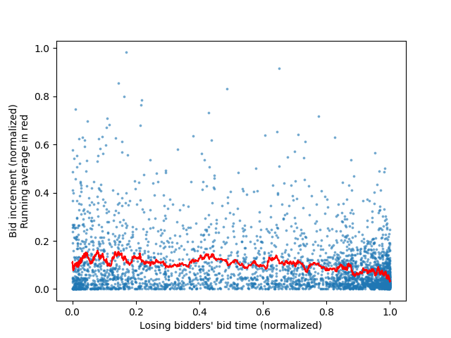
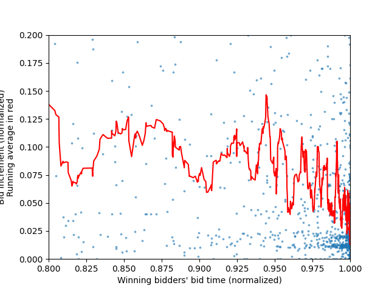
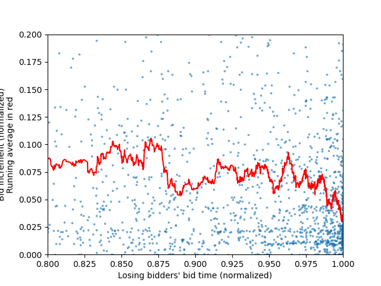

# eBay Auctions: A Simple Data Analysis

### Antoine Dangeard

#### Worked on from 21/12/2022 to 23/12/2022.

#### Started and finished offline. (thus the lack of git commits)

## Objective:
Using this eBay auction dataset, identify if the timing of a bid (bidding earlier or later, with respect to the time left in the auction) relates to the likelihood of that bid winning the auction. Moreover, another objective is to identify if the bidding increment (difference between a new bid and the previous highest bid) has a clear impact on a bidder's chance of winning the auction.

## Hypothesis:
I expect that later bids (i.e. auction "sniping") will be a popular strategy, but not clearly indicative of winning an auction, because of eBay's automatic bidding feature (bids are automatically placed for a bidder up until a maximum amount). I also expect that stronger (higher increment) bids placed later in the auction will be more likely to succeed, as it is likely more bidders will be deterred by a large "jump" in bid price (and their automatic bidding maximum is more likely to be less than this bid), and those who are not deterred/have a lesser maximum bid will have less time to place a higher bid before the auction ends.

## Description of the dataset:
The dataset, obtained online, contains 10681 bids from 628 auctions that took place on eBay. These auctions are for 3 categories of items (Cartier wrist watches, Xbox gaming consoles, and the Palm Pilot M515 PDA), and each bid entry contains the following columns (names modified for clarity): auction id, bid amount, bid time (in days from auction start), bidder name, bidder rating, opening bid, final bid price, item category, and auction length (in days). It is in the form of a CSV, contained in the file "auction_data.csv", in the "data" folder in this repository.

## Limitations of the dataset:
The dataset is limited by the fact that it only includes auctions from only 3 categories of items, which means it is not truly indicative of auctions on eBay as a whole. Another limitation of the dataset is that the real market value of the item at auction is not available and no information given allows us to estimate it well (since the market value depends on the condition, specific model, calendar date of the auction, etc.). This means it is not feasible to estimate the "success" (i.e. auction return vs. market price) of the auction from the seller's perspective, nor from the buyer's perspective. This also limits our ability to compare auctions between one another, since they all can have very different market prices, and therefore their bidding would behave differently from one another. Moreover, the dataset does not include an item category which has a low market value, since auctions at lower prices could behave very differently from auctions for more expensive items.

## Data cleaning:
- bidder rating column removed (deemed not useful in this analysis)
- bid times normalized (from 0 to 1) with respect to the length of the auction
- bids which are not higher than the previous highest bid are removed (since they do not affect the outcome of the auction)
- successive bids made by the same bidder are combined into one bid, taking the value and timing of the last/highest bid made (since they do not affect who wins the auction)
- seperated data by category, then auction_id, then seperate entries for bids, opening_bid, and duration. This was done to avoid repeating data, and minimize memory usage.

## Method:
To identify the bidding strategy which has proven most likely to win, all the winning bidders' bids are isolated in the dataset, and graphed as a histogram with respect to the time until the end of the auction (0 is the start, 1 is the end of the auction). This plot is shown in Figure 1 below. The same process is repeated for all bids placed by bidders who did not win auctions (dubbed "losers"), and the result is shown in Figure 2. While creating our data for these graphs, with each bid, we also save it's bid increment (the change in the bid's price from the previous highest bid). This results in 2 arrays (one for bid times, one for bid increments), which can be plotted as two scatter plots (one for the winners' bids, another for the losers'). To make the general trend clearer, and since the resulting scatter plots are fairly noisy, a running average line is added, to show the average bid increment with respect to time. These scatter plots are shown below as Figure 3 and Figure 4. Finally, since a large majority of the bids are placed near the end of the auction, Figures 3 and 4 are re-generated with new axis bounds, so as to focus on the bids placed near the end of the auction. These "cropped" graphs are shown below as Figures 5 and 6.

## Results:

**Figure 1: Winning bidders' bid placement timings as a histogram**

**Figure 2: Losing bidders' bid placement timings as a histogram**

**Figure 3: Winning bidders' bid placement timings on x axis, bid increment on y axis, as well as a running average in red**

**Figure 4: Losing bidders' bid placement timings on x axis, bid increment on y axis, as well as a running average in red**

**Figure 5: Same graph as Figure 3, but focusing on the end of the auction.**

**Figure 6: Same graph as Figure 4, but focusing on the end of the auction.**

## Discussion:
We can clearly see in Figure 1 that the most successful strategy for winning auctions is indeed "sniping" (waiting until the auction is about to end before bidding). However, this strategy is not going to guarantee a win at all. As can be seen in Figure 2, although auction losers bid much more during the beginning and middle of the auction than the winners do, the graphs show that the auction losers also bid a lot more near the end of an auction than any other time, just like the winners. Therefore, this strategy of waiting until the end of an auction is not going to differentiate the winners from the losers. What's more likely to differentiate a winning bidder from a losing bidder, it seems, is patience: a lack of bids early in the auction could point to a winning bidder, and many bids early in the auction could indicate a losing bidder. However, this is only an observation of the dataset, and could not be used to reliably determine auction winners.

Observing figures 3 and 4 now, we can see that the bid increments of winners and losers are also fairly similar. Although the winners seem to bid using higher increments than the losers (both on average, but especially early in the auction), we can see that as the auction nears it's end (see figures 5 and 6 for end-of-auction bid increments), when the bids matter most, both losers and winners seem to average out to similar increments. Moreover, the data for auction winners' bids is much more sparse, and therefore the running average becomes less meaningful as a comparison to the losers, since there are less data points to balance it out.

However, one difference can be deduced from these graphs: given that there are less bids placed by auction winners, yet these bids vary in bid increment at least as much as the bids placed by auction losers do (visually, we can see that the points on the winners' graph are more sparsely distributed and have the same extremes as the losers' graph), we can infer that the bid increments in bids placed by winners are, on average, more extreme. This indicates that the average auction winner places bids with increments that are probably going to be as large or larger than those placed by an auction loser, or fairly small, but they will less likely be "moderate" increments, in comparison to auction losers.

## Conclusion:
In conclusion, it is difficult to differentiate auction winners from auction losers using only this analysis. This points to auctions being more luck than skill, in that it is simply the person who bids latest and guesses the optimal amount as a bid who will win, rather than there being any real strategy or bidding patterns which one can employ to make winning highly likely. This confirms the first part of our hypothesis, since indeed "sniping" is the most effective strategy, but is also very common among auction losers. The second part of our hypothesis is incorrect, however, as large bid increments do not show any clear correlation to increased chances of winning. However, what we can deduce from our findings is that, in order to maximize one's chances of winning an auction, bids should never be placed early into the auction, since these are almost always going to be outbid and will encourage larger bids from other parties, thus increasing the overall price that needs to be paid for the item. Instead, one should wait as long as possible before placing any sort of bid, and, when placing a bid, it should be with an "extreme" increment: either a significantly large increment (to deter other bidders) or a very small increment (to minimize the price of the item at the end of the auction), but "moderate" increments are characteristic of auction losers.

